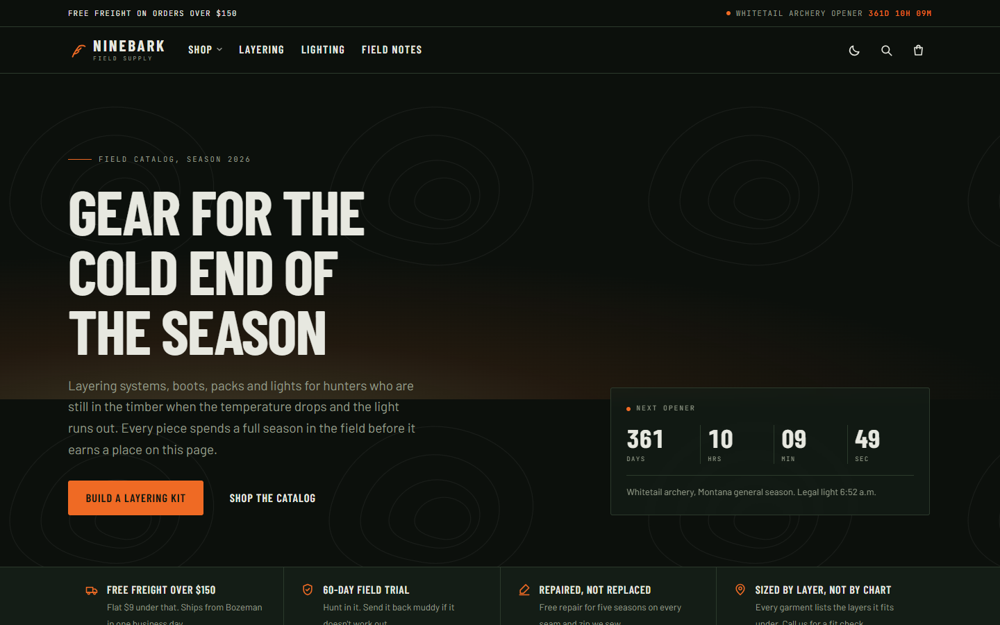
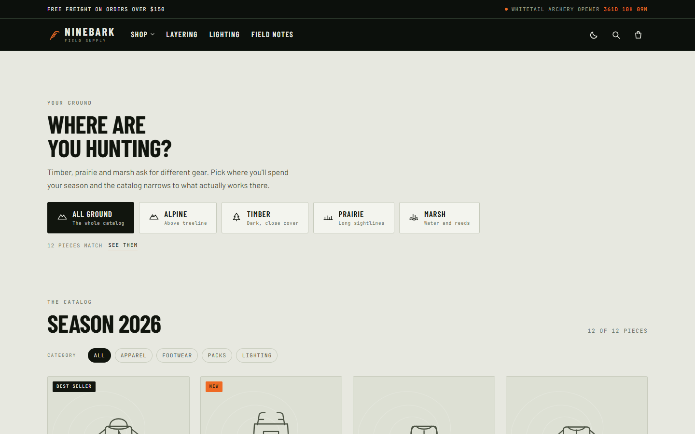
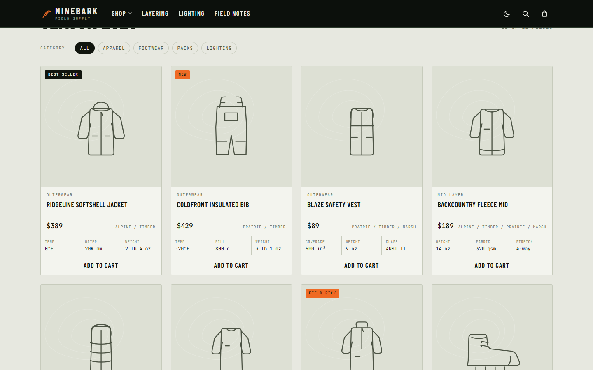
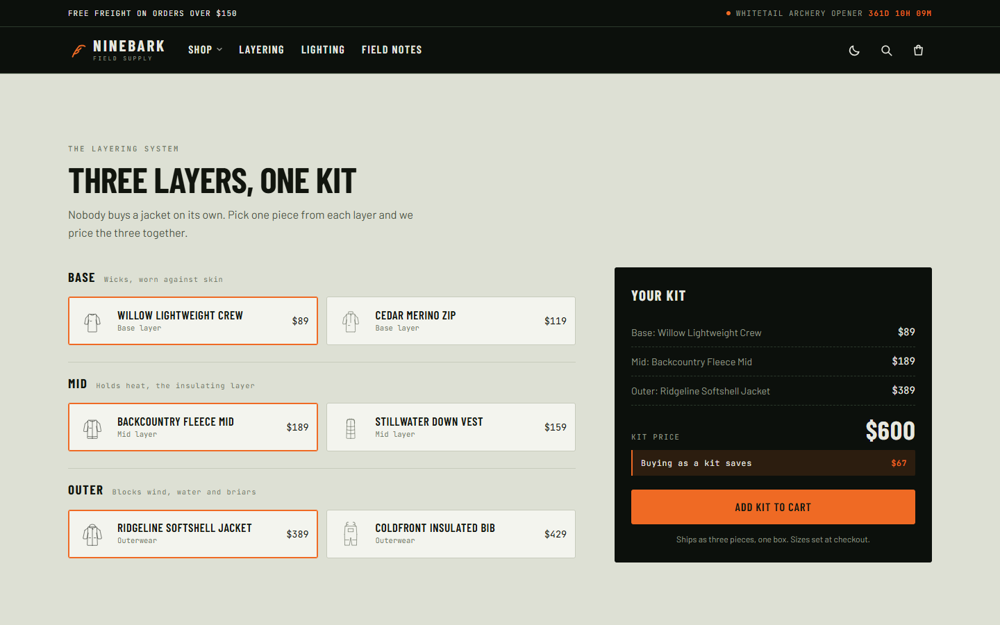
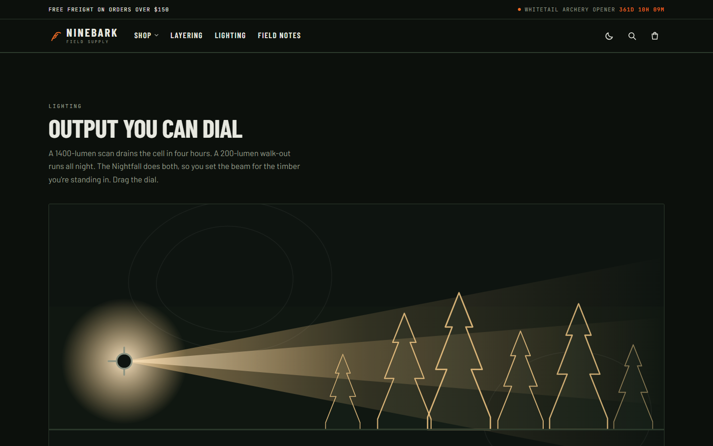
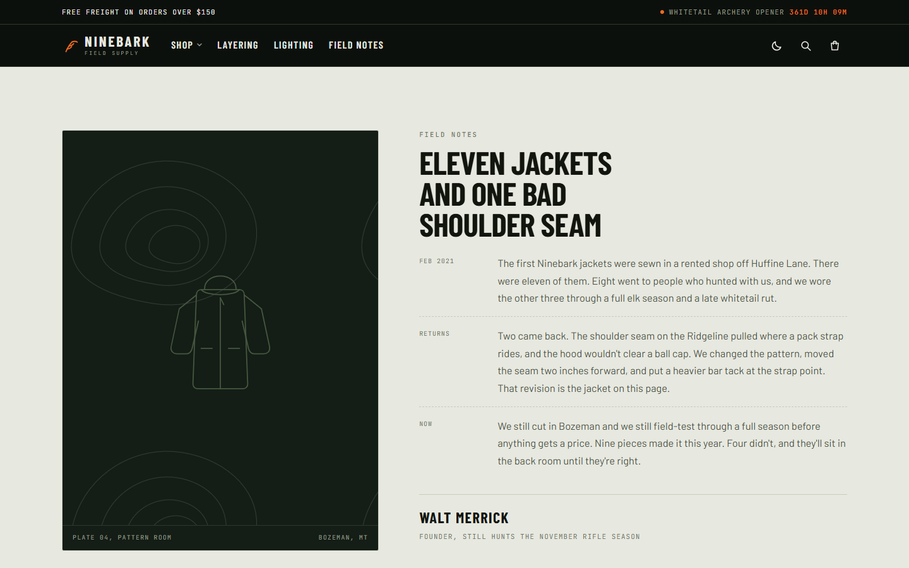
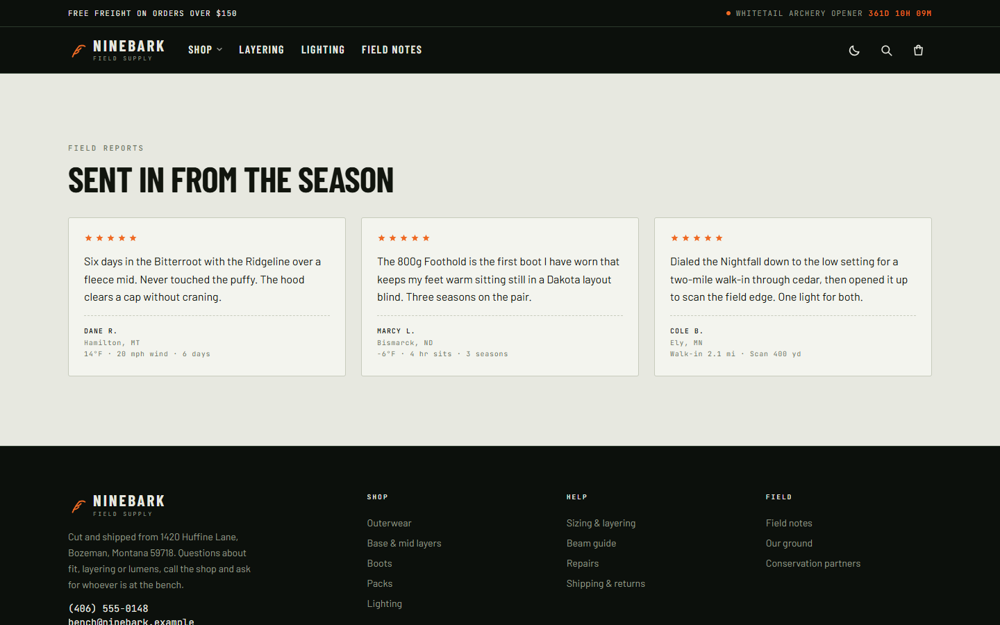
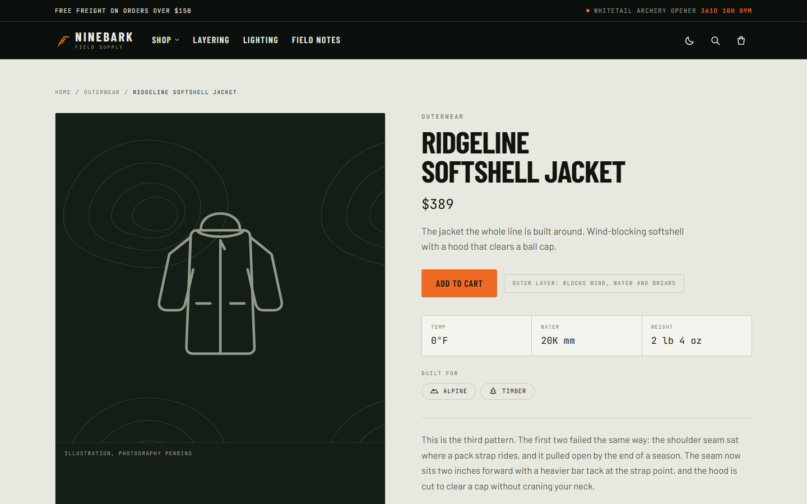
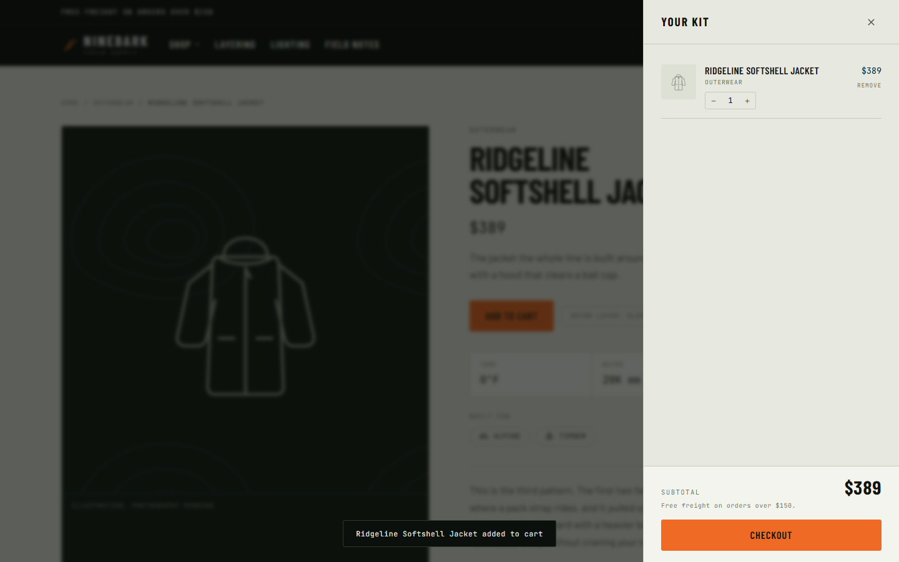
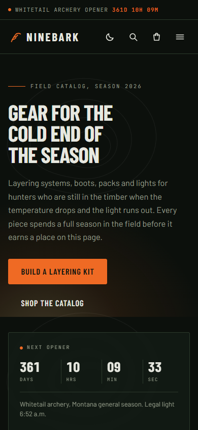

# Ninebark Field Supply

Hunting apparel and lighting storefront: layering kits, a catalog that narrows
to the ground you hunt, and a headlamp beam you can dial. Next.js 16 (App
Router), TypeScript, Tailwind v4. The build emits a folder of static files, and
there is no server in production.

There is no database, no CMS, no checkout and no accounts. Content lives in JSON
files under `/content`, and every read goes through one module so a CMS can be
added later without touching the pages.



## Screens

| | |
|:--:|:--:|
| <br>**Shop**: pick your ground and the catalog narrows | <br>**Catalog**: twelve pieces, filters carried in the URL |
| <br>**Layering**: one piece per layer, priced as a kit | <br>**Lighting**: dial the beam and reach and runtime follow |
| <br>**Field notes**: the founder's letter | <br>**Reports**: what came back from the season |
| <br>**Product**: specs and the layers it fits, statically generated | <br>**Cart**: real lines and quantities, in `localStorage` |

<details>
<summary>Also dark mode, and the phone layout</summary>

| | |
|:--:|:--:|
|  |  |

</details>

## Routes

Six routes, each a folder under `app/`. All statically prerendered at build time.

| Route | Holds |
| --- | --- |
| `/` | Landing: hero, trust strip, four featured products, a teaser per section, newsletter |
| `/shop/` | The terrain picker and the catalog grid |
| `/layering/` | The kit builder |
| `/lighting/` | The beam demo |
| `/field-notes/` | The founder's letter |
| `/reports/` | Field reports |

Plus `/products/<id>/`, generated by `generateStaticParams`.

The home page is a front door, not the site. Each section that used to be stacked
on it has its own route and appears on `/` only as a teaser card.

`/shop` is the one route carrying two sections. `GroundPicker` writes the ground
filter and `Catalog` reads it, so splitting them would leave the picker changing
state that nothing on screen responds to. They stay together.

### Filters live in the URL

`/shop/?ground=timber&group=apparel&q=boot` is shareable, bookmarkable and
survives a refresh. The header mega-menu links land on a filtered grid.

The mechanism in `components/store/FilterProvider.tsx` is split deliberately:

- **Reading** is a leaf that calls `useSearchParams()`, renders `null`, and sits
  alone inside `<Suspense fallback={null}>`. Under `output: "export"` a
  `useSearchParams()` call suspends during prerender and the boundary's
  *fallback* is what gets serialised into the HTML. Because that fallback is
  `null`, `/shop/index.html` still ships all twelve product cards and filtering
  is progressive enhancement. Wrapping the provider itself would have replaced
  the header, footer and grid with the fallback in the export.
- **Writing** is `window.history.replaceState`, which Next 16 patches so it
  updates the address bar *and* keeps `useSearchParams` in sync, with no
  navigation, no fetch and no scroll change. `router.replace` would be a real
  navigation with a segment-cache miss for every search string it had not seen.

The query is the one filter that does not write on change: the header calls
`setQuery` per keystroke and each write would dispatch a router restore. It
commits on submit.

Unknown values are dropped rather than honoured: `?group=nonsense` renders the
unfiltered grid, not an empty one.

## Commands

```bash
pnpm install
pnpm dev        # http://localhost:3000, with hot reload
pnpm build      # prerenders every route into out/
pnpm preview    # serves out/ the way Hostinger will, at :4000
pnpm typecheck
```

Use pnpm, not npm. Running npm here creates a second lockfile and a duplicated
`node_modules`.

## The content seam

Pages and components never import from `/content`. They call `lib/content.ts`
and nothing else.

```
app/**  ->  lib/content.ts  ->  lib/sources/file.ts  ->  /content/*.json
                  |
                  +->  lib/sources/payload.ts   (later)
```

Only the pages import it: every file under `app/` that needs content, plus
`app/layout.tsx`. Components take content as props and never fetch.

If a component reaches into `products.json` on its own, that component has to be
edited again when the CMS lands. Add a function to `lib/content.ts` instead.

Check that the rule still holds:

```bash
# Any import reaching into /content from a page or component. Should be empty.
grep -rn 'from ".*content/' app components
```

(Grep for the filenames instead and you get false positives: several files
mention `content/pages.json` in a comment or an error message without reading
it.)

## Adding a CMS later

1. Write `lib/sources/payload.ts` implementing `ContentSource` from
   `lib/types.ts`. Six functions:

   ```
   getSettings  getTaxonomy  getProducts  getProduct  getReports  getPages
   ```

   `getPages()` returns every route's copy, keyed by route (`home`, `shop`,
   `layering`, `lighting`, `fieldNotes`, `reports`). One key per page rather
   than one blob, because the CMS wants an editor editing "the shop page" as
   its own document.

   `getProductMap()` and `getLayeredProducts()` derive from `getProducts()`, so
   a new source does not implement them.

2. Flip one line in `lib/content.ts`:

   ```ts
   // const source: ContentSource = fileSource;
   import { payloadSource } from "./sources/payload";
   const source: ContentSource = payloadSource;
   ```

3. Fill in `.env.local` from `.env.example`.

Nothing in `app/` or `components/` changes. Keep `fileSource` in the repo. It
costs nothing, and it lets `next build` run on a machine with no database.

### Neon setup notes

- Use the pooled connection string and keep `sslmode=require`. The host has
  `-pooler` in it.
- Pin `pool.max` around 3. Serverless instances multiply and will exhaust
  Postgres connections without a cap.
- Watch Payload's job queue. It can wake Neon on a schedule and burn compute
  hours on a site with no traffic. If CU-hours climb while traffic stays flat,
  constrain the auto-run or drive it from an external cron. Compute sleeps after
  5 minutes idle, so an idle site should cost nothing.
- Media goes to Vercel Blob, not Postgres. Neon's 0.5 GB holds text and
  metadata, which is kilobytes per product.
- Hostinger is the domain only. Payload does not speak MySQL, and shared hosting
  cannot run the persistent Node process it needs.

### Adding photos

`Product.image` exists, and both the card and the product page render it, falling
back to the SVG illustration. To switch over:

1. Set `image` on the product.
2. Swap the two `` tags for `next/image`. Each is marked with a comment.

There is no `images.remotePatterns` step. Under `output: "export"` the loader is
set to `unoptimized`, so Next never fetches the file server-side and does not
care which host it came from. The cost is that no resizing or AVIF/WebP
conversion happens, so serve photos at the size they are displayed, or accept
the bytes. A custom loader that rewrites to a resizing service is the escape
hatch if that becomes a problem.

Products without a photo keep their illustration, so this can happen one product
at a time.

## Content files

| File | Holds |
| --- | --- |
| `content/settings.json` | Brand, contact, season opener, nav, announcements, trust strip, footer |
| `content/products.json` | The catalog, keyed by `id`, which is also the URL slug |
| `content/taxonomy.json` | Grounds, category groups, layering rows |
| `content/pages.json` | Copy for every route, keyed by route |
| `content/reports.json` | Field reports |

### Adding a product

Append to the `products` array in `content/products.json`. The types are in
`lib/types.ts`, and a missing field fails `pnpm typecheck`.

Two things are required:

- `specs` must have exactly three entries. The spec strip on a card is a three
  column grid, and a row of cards only reads as a comparison table when every
  card carries the same three cells.
- `art` must name a key in `lib/art.tsx`, or the product needs an `image`
  instead.

`ground` and `group` ids have to exist in `taxonomy.json`. `layer` must be
`base`, `mid` or `outer` for a piece to show up in the kit builder.

## Layout

```
app/
  layout.tsx                fonts, providers, header/footer/drawers
  page.tsx                  the landing page: hero, featured row, teaser grid
  shop/page.tsx             grounds picker + catalog grid
  layering/page.tsx         kit builder
  lighting/page.tsx         beam demo
  field-notes/page.tsx      founder's letter
  reports/page.tsx          field reports
  products/[slug]/page.tsx  product detail, statically generated
components/
  store/                    client state: cart, drawers, toast, filters
  ui/                       Button, Chip, Eyebrow, SectionHeading, Scrim, icons
  Teaser.tsx                landing-page card pointing at a section's route
  <section>.tsx             one file per page section
content/                    all copy and catalog data
public/
  .htaccess                 copied into out/, Apache config for Hostinger
scripts/
  serve.mjs                 preview server for the export (pnpm preview)
docs/
  screenshots/              the images in this README
lib/
  content.ts                the seam
  sources/file.ts           reads /content, the only fs access in the app
  types.ts                  the contract every source satisfies
  art.tsx                   placeholder product illustrations
  theme.ts                  theme key and the pre-paint script
  format.ts                 money, plural, the kit discount
  cn.ts                     class-name join; no tailwind-merge, on purpose
```

The page tree renders on the server. Client components are the interactive
islands: the cart, drawers, filters, kit builder and beam dial.

## Not built yet

- Checkout. The cart is real and holds lines, quantities and a subtotal in
  `localStorage`, but the button says no payment provider is connected.
- Forms that store submissions. The newsletter validates the address and reports
  that nothing was saved.
- Comments and user accounts.

## Deploying

Hostinger, as plain static files. `output: "export"` in `next.config.ts` makes
`pnpm build` write a self-contained site into `out/`. Upload the **contents** of
that folder into `public_html/`:

```bash
pnpm build
# then upload everything inside out/ (FTP, SFTP, or hPanel File Manager)
```

About 4 MB across ~160 files, so any upload method works. There are no
environment variables, no database and no Node process on the server.

Two settings in `next.config.ts` exist specifically for shared hosting:

- **`trailingSlash: true`** writes `products/blaze-vest/index.html` instead of
  `products/blaze-vest.html`. Apache and LiteSpeed do not map the extensionless
  `/products/blaze-vest` onto the `.html` file, so without this every product URL
  404s unless you hand-write rewrite rules. With it, the host's own
  directory-index handling serves the page. Product URLs end in a slash.
- **`images.unoptimized: true`** is required by `output: "export"`, which has no
  server to resize images on demand.

`public/.htaccess` is copied into `out/` by the build, so host config is
version-controlled rather than hand-edited on the server. It sets the styled 404
(`404.html`), compression, long cache lifetimes for the fingerprinted
`_next/static` assets, no-cache for HTML, and a few security headers. The HTTPS
redirect at the bottom is commented out. Enable it only after the SSL
certificate is issued, or it redirect-loops a domain with no working TLS.

`.htaccess` does not apply to `pnpm preview`, which is a plain Node server. Cache
and compression behaviour only exists on the live host; check it there.

### What Hostinger cannot host

The static site, yes. Payload CMS, no. Payload needs a persistent Node process
and does not speak MySQL, so shared hosting cannot run it. Deploying the CMS
means a second host for the admin app; the storefront keeps exporting to
Hostinger and points at it over HTTP through `lib/sources/payload.ts`.

`agentRules: false` in `next.config.ts` stops Next.js writing `AGENTS.md` and
`CLAUDE.md` into the repo root on every dev run.
